# Barkr Daily Pricing Analysis — Artwork, Cars, and Memorabilia

This README is the complete report for the three daily-sale exports. It includes the auction-house estimate benchmark, data-quality decisions, segment findings, visual outputs, unresolved analysis points, and the requirements for completing the Barkr/local-pricer comparison.

## Contents

- [Executive summary](#executive-summary)
- [Analysis-point status](#analysis-point-status)
- [Scope, data, and matching rules](#scope-data-and-matching-rules)
- [Artwork](#1-artwork)
- [Cars](#2-cars)
- [Memorabilia](#3-memorabilia)
- [Cross-asset interpretation](#cross-asset-interpretation)
- [Required prediction data](#what-is-needed-to-complete-the-original-project)
- [Graphs and visual appendix](#graphs-and-visual-appendix)
- [Files and reproducibility](#reproducibility-and-supporting-files)

## Analysis-point status

| Requested analysis point | Status | Result or reason |
|---|---|---|
| Local-pricer accuracy versus actual results | Not possible yet | No local-pricer predictions are present in any of the three exports. |
| Local pricer versus Barkr | Not possible yet | Neither method has item-level prediction values, timestamps, or a common join key. |
| Auction-house low, high, and midpoint accuracy | Complete for usable samples | Completed for Artwork (N=29,095), Cars events (N=128 and 23), and Memorabilia (N=2,360). |
| Barkr/local predictions versus auction-house ranges | Not possible yet | Prediction values are missing. |
| Value beyond the auction-house midpoint | Not possible yet | Requires matched Barkr/local predictions and the same actual price basis. |
| Segment performance by subtype, house, price band, and period | Partially complete | Completed for available Artwork and Memorabilia fields and Cars event groups; deeper model segments await predictions. |
| Barkr pricing accuracy | Not possible yet | Barkr estimate file was not supplied. |
| Error magnitude, bias, and sample size | Complete for auction-house estimates | Median APE, dollar error where USD is usable, signed bias, and N are reported. |
| ±10%, ±20%, and ±30% thresholds | Complete for auction-house estimates | Reported for low, midpoint, and high estimates. |
| Overpricing versus underpricing | Complete for auction-house estimates | Signed bias and below/within/above range shares are reported. |
| Artist, brand/model, material, rarity, and condition analysis | Partial | Artwork medium/material/name coverage was inspected; Cars model-level accuracy is too sparse; rarity and condition are not reliably structured. |
| Price-range performance | Complete with cautions | Artwork and Memorabilia use pre-sale midpoint bands; Cars is event-level because the matched sample is small. |
| Auction-house performance | Descriptive benchmark complete | House tables include N and coverage; mix and selection differences prevent an unadjusted causal ranking. |
| Performance over time | Partial | Sale-quarter analysis is available; pricing-run dates are absent, so model drift cannot be measured. |
| Largest misses and recurring causes | Review lists complete | Largest percentage and dollar misses are exported; source-page review is still needed to confirm causes. |
| Duplicates, labels, dates, currencies, and units | Complete at export level | Duplicate URLs, conflicting records, missing fields, house-label corrections, currency inference, and date anomalies are documented. |
| Sold versus unsold | Partial | Artwork has explicit Sotheby's statuses; Cars `current_status` is registration/condition; Memorabilia has no sale-status field. |
| Standard versus Llama | Not possible yet | Standard and Llama item-level prediction files are absent. |

The rest of this README gives the evidence for the completed rows and preserves the reasons for the incomplete rows. “Not possible yet” means the calculation is defined and ready once the required prediction data is supplied; it does not mean the metric is unnecessary.

**Report date:** 25 September 2026  
**Data:** Daily-sale exports for Artwork, Cars, and Memorabilia  
**Analysis status:** Auction-house estimate benchmark complete for the usable samples. Barkr, Local Pricer, Standard, and Llama comparisons are pending item-level prediction data.

## Executive summary

The three exports contain **50,008 raw rows**: 43,530 Artwork, 1,666 Cars, and 4,812 Memorabilia. They support a useful benchmark of auction-house pre-sale estimates against recorded results, but the usable samples differ sharply. The Artwork comparison covers 29,095 lots. The Memorabilia comparison covers 2,360 lots. The Cars comparison covers only 151 lots from two events after matching estimates to results and inferring hammer prices from published buyer-premium schedules.

On these matched samples, the **low estimate has a smaller median absolute percentage error than the midpoint** in all three asset analyses. The midpoint's error is **34.98% for Artwork**, **37.38% for Gooding Cars**, **11.11% for RM Abu Dhabi Cars**, and **36.84% for Memorabilia**. The RM Abu Dhabi result is based on only 23 cars and must not be generalized to all car auctions. These figures describe auction-house estimates. They do **not** measure Barkr or local-pricer accuracy.

The most important practical finding is that the comparison sample must be defined before drawing conclusions. Duplicate and conflicting lot URLs affect Artwork; Cars price fields require event-specific premium inversion; Memorabilia contains missing currencies and mislabelled auction houses. Coverage differs by house and asset. Raw house rankings therefore mix pricing performance with differences in item type, value, and data availability.

### Headline comparison

| Asset/sample | Matched N | Midpoint median absolute % error | Midpoint median signed % error | Midpoint median absolute USD error | Within ±10% | Within ±20% | Within ±30% | Result below / within / above estimate range |
|---|---:|---:|---:|---:|---:|---:|---:|---:|
| Artwork | 29,095 | 34.98% | +4.17% | $3,525 | 13.45% | 29.98% | 42.79% | 31.52% / 32.45% / 36.03% |
| Cars: Gooding Amelia Island 2025 | 128 | 37.38% | +37.38% | $67,500 | 10.94% | 25.00% | 39.84% | 78.91% / 14.84% / 6.25% |
| Cars: RM Abu Dhabi 2025 | 23 | 11.11% | +9.76% | $150,000 | 43.48% | 86.96% | 95.65% | 47.83% / 43.48% / 8.70% |
| Memorabilia | 2,360 | 36.84% | +9.09% | $528.75 (N=2,300) | 14.19% | 27.97% | 42.42% | 32.63% / 37.37% / 30.00% |

**How to read the table:** Signed percentage error is `(estimate − actual) / actual × 100`; positive values mean the estimate exceeds the recorded result. Absolute percentage error ignores the direction. “Within ±20%” means the estimate differs from the actual result by no more than 20% of the actual result. Dollar errors are medians of absolute dollar differences, not percentages. The Cars actuals are *inferred hammers*; Artwork and Memorabilia use `ah_price` as a pre-premium result proxy. The asset and event rows are not a controlled competition between markets or houses.

## Scope, data, and matching rules

| Asset | Raw rows | Distinct lot URLs after stated cleaning | Final estimate-comparison sample | Approximate share of distinct lots | Basis and main restriction |
|---|---:|---:|---:|---:|---|
| Artwork | 43,530 | 39,976 retained after conflict exclusions | 29,095 | 72.78% | Positive `ah_price` and valid estimate range; native currency |
| Cars | 1,666 | 1,412 raw distinct URLs | 151 | 10.69% | Two USD events; premium-inclusive sold amount inverted to an inferred hammer |
| Memorabilia | 4,812 | 4,782 | 2,360 | 49.35% | Positive `ah_price`, valid estimate range, usable observed or sale-inferred currency |

The analysis unit is a **lot URL**, not an export row or an ID. A lot is eligible for percentage-error analysis when its actual price is positive, both estimates are positive, the low estimate does not exceed the high estimate, and a comparable currency is available. Missing or zero actual prices are excluded from error calculations; they are never counted as zero sales. The low and high estimates are evaluated separately, and their arithmetic mean is the midpoint.

Artwork and Memorabilia comparisons use each lot's **native currency** for percentage errors. USD fields are used only for dollar-error measures. For Cars, published sold prices appear to include buyer's premium while auction estimates exclude it, so the event's premium schedule is inverted before comparison. There is no pooled Cars estimate-error figure because only two distinct events qualify, with substantially different prices and lot mixes.

### Price basis and currency cautions

- Artwork's `ah_bp_price` is typically about 1.20 times `ah_price`; this supports treating `ah_price` as hammer and `ah_bp_price` as premium-inclusive. It remains a field-convention inference.
- Memorabilia shows `ah_bp_price / ah_price` around 1.20–1.28, supporting the same interpretation. Some `ah_price` values are decimal equivalents rather than literal round bids; the report calls them pre-premium price proxies until the data owner confirms their derivation.
- In Cars, all 993 rows with both price fields have `ah_price = ah_bp_price`. That equality prevents a direct hammer-to-estimate comparison and motivates the separate premium inversion.
- For 247 matched Christie's Memorabilia lots, the export omits currency. Currency is inferred from the linked sales: 221 Jim Irsay lots are treated as USD and 26 Groundbreakers lots as GBP. Christie's publishes the Irsay collection in US-dollar estimates and results and identifies Groundbreakers as a London sale with sterling estimates. These rows are flagged for review. See [Christie's Irsay collection](https://press.christies.com/the-jim-irsay-collection/) and [Groundbreakers](https://press.christies.com/christies-groundbreakers-icons-of-our-time?lang=eng).

## 1. Artwork

### Sample and data quality

The Artwork export contains 43,530 rows from Bonhams, Christie's, Freemans, Hindman, Phillips, and Sotheby's. It includes both `Art` and `Artwork` as asset labels. Estimate strings with comma separators, such as `10,000`, were converted to numbers before filtering. Raw rows have 769 repeated IDs and 3,420 duplicate-URL rows; ID alone is therefore unsuitable as the match key. Among repeated URLs, some have conflicting prices or houses. The reproducible pipeline excludes **134 URLs** with conflicting auction house, hammer, or estimate fields and keeps one most-complete record per remaining URL. This yields **39,976 retained unique lots**; **29,095** have positive hammer prices and valid estimate ranges.

In the retained file, 7,738 lots are explicitly marked `sold` and 1,896 explicitly `unsold`, all from Sotheby's. The other **30,342** have no status value; 23,389 of those have a positive `ah_price`, while 6,953 do not. No-status, no-price rows must remain “outcome unknown.” Ninety-two comparison lots lack a valid sale date. There are 124 comparison lots whose estimate-implied USD conversion differs from the hammer-implied conversion by more than 1%; excluding those rows does not change the reported midpoint median percentage or USD error at two-decimal precision.

### Estimate performance

| Estimate | N | Median absolute % error | Median signed % error | Median absolute USD error | Within ±10% | Within ±20% | Within ±30% |
|---|---:|---:|---:|---:|---:|---:|---:|
| Low | 29,095 | 33.55% | −16.29% | $3,105.81 | 19.10% | 34.22% | 45.99% |
| Midpoint | 29,095 | 34.98% | +4.17% | $3,525.00 | 13.45% | 29.98% | 42.79% |
| High | 29,095 | 41.73% | +25.00% | $4,275.60 | 11.10% | 23.43% | 35.15% |

Hammer falls below the published range for 31.52% of lots, inside it for 32.45%, and above it for 36.03%. The near-balanced below/above percentages hide large misses in both directions. The low estimate has the smallest median absolute error, but its median signed error is negative: it tends to sit below realized hammer.

### Auction houses, medium, value, and time

| House | N | Midpoint median absolute % error | Within ±20% | Median hammer USD | Eligible share of retained house lots |
|---|---:|---:|---:|---:|---:|
| Phillips | 3,322 | 32.35% | 32.24% | $7,572 | 68.35% |
| Bonhams | 5,283 | 33.33% | 31.40% | $3,291 | 52.82% |
| Sotheby's | 7,719 | 34.98% | 30.57% | $20,833 | 80.08% |
| Christie's | 10,669 | 35.58% | 29.19% | $21,432 | 82.76% |
| Freemans | 417 | 41.18% | 25.18% | $2,750 | 88.16% |
| Hindman | 1,685 | 44.67% | 24.51% | $2,400 | 79.82% |

Phillips has the lowest observed house-level midpoint error and Hindman the highest. Their sample value and coverage differ. The lowest realized-hammer band is also notably harder in the raw comparison, so house ranking needs matching on value and item mix before a performance claim.

By medium, paintings (N=10,292) have 33.55% midpoint median error, prints (N=5,076) 33.04%, drawings (N=2,931) 35.83%, mixed media (N=2,862) 33.93%, sculpture (N=2,156) 34.98%, photographs (N=2,177) 40.63%, decorative arts (N=1,616) 40.94%, ceramics (N=1,151) 40.34%, and furniture (N=745) 49.80%. The single calligraphy lot has an extreme percentage error and is not a meaningful medium-level sample. Names and materials should be normalized before narrower artist or material claims; the export includes, for example, separate uppercase and title-case entries for the same artists.

To describe value without sorting by the result, lots are banded on **pre-sale estimated USD midpoint**:

| Estimated midpoint USD band | N | Midpoint median absolute % error |
|---|---:|---:|
| Up to $3,500 | 7,302 | 44.21% |
| $3,500–$10,000 | 7,718 | 38.89% |
| $10,000–$40,000 | 7,272 | 32.51% |
| Above $40,000 | 6,803 | 27.32% |

This is a descriptive decline in error as pre-sale value rises, not evidence that value alone causes better estimates. The bands contain different houses and media. In the lowest **realized** price band, midpoint estimates are frequently too high; that result is useful for diagnosing bias but should not be used as a pre-sale decision rule because the band uses the outcome.

Sale-quarter median errors are 47.51% (2024Q1, N=550), 37.82% (2024Q2, N=558), 38.95% (2024Q3, N=233), 31.23% (2024Q4, N=353), 45.83% (2025Q1, N=167), 38.89% (2025Q2, N=205), 31.60% (2025Q3, N=1,839), 33.93% (2025Q4, N=9,688), 36.08% (2026Q1, N=6,401), 36.00% (2026Q2, N=6,596), and 37.01% (2026Q3, N=2,413). Early quarters have small and changing samples. These are **sale-date** cohorts; the export has no pricing-run date.

### Largest misses

All 20 largest percentage misses in the saved review list are results below their estimates. One especially suspicious record has hammer **GBP 0.83** (about **$1.05**) against a **GBP 400–600** estimate; it should be checked against its source lot page before being used in a narrative about pricing. The largest dollar misses are dominated by expensive paintings: 17 of the top 20 are paintings, with ten results above and ten below their midpoints. Percentage and dollar rankings therefore answer different questions.

## 2. Cars

### Why the sample is small

The Cars export has **1,666 rows** and **1,412 distinct lot URLs**. It has 254 duplicate-URL rows, seven URLs with conflicting recorded sold prices, 487 rows with no auction-house label, and 386 rows with no sale date. The `current_status` field describes registration or condition, not whether a car sold. Only **156 URLs** match a positive result to a valid estimate range: 132 Gooding Amelia Island 2025, 23 RM Abu Dhabi 2025, and one RM Paris 2026.

The Paris match is excluded because its estimate and result rows have different dates and the EUR price basis remains unresolved. Four Gooding lots are excluded because their official sold amounts do not invert to a plausible round bid under the vehicle premium schedule; their sold amounts appear in the source pages, so the ambiguity is the price basis, not whether a number was captured. The final comparison is **128 Gooding plus 23 RM lots**, or **151 cars from two events**. These are only about 10.69% of distinct Cars URLs in the export.

For Gooding, the [official conditions](https://www.goodingco.com/terms/) describe a vehicle premium of 12% through $250,000 hammer and 10% on the excess for US live auctions. Inversion of that schedule places 128 of 132 candidate implied hammers within $1 of a $100 bid increment. For RM Abu Dhabi, [event bidder information](https://rmsothebys.com/auctions/ad25/bidder-info/) gives 15% through $200,000 hammer and 12.5% above; all 23 implied hammers pass the same round-bid check. These **inferred hammers are calculations**, not observed hammer fields in the export. The calculation inverts the stated buyer-premium rates; any additional tax or VAT treatment requires source-level confirmation.

### Event-level performance

| Event | Estimate | N | Median inferred hammer | Median absolute % error | Median signed % error | Median absolute dollar error | Within ±10% | Within ±20% | Within ±30% |
|---|---|---:|---:|---:|---:|---:|---:|---:|---:|
| Gooding Amelia Island 2025 | Low | 128 | $150,000 | 25.00% | +23.23% | $41,250 | 21.88% | 40.62% | 56.25% |
| Gooding Amelia Island 2025 | Midpoint | 128 | $150,000 | 37.38% | +37.38% | $67,500 | 10.94% | 25.00% | 39.84% |
| Gooding Amelia Island 2025 | High | 128 | $150,000 | 54.65% | +54.65% | $90,000 | 7.03% | 15.62% | 22.66% |
| RM Abu Dhabi 2025 | Low | 23 | $825,000 | 7.25% | 0.00% | $50,000 | 69.57% | 86.96% | 95.65% |
| RM Abu Dhabi 2025 | Midpoint | 23 | $825,000 | 11.11% | +9.76% | $150,000 | 43.48% | 86.96% | 95.65% |
| RM Abu Dhabi 2025 | High | 23 | $825,000 | 17.65% | +17.65% | $250,000 | 21.74% | 56.52% | 82.61% |

Gooding results fall **below / within / above** their published estimate ranges in **78.91% / 14.84% / 6.25%** of analyzed lots. For RM Abu Dhabi, the corresponding shares are **47.83% / 43.48% / 8.70%**. The low estimate has the smallest median absolute error at both events. The contrast between the events is large, but the cars and their value levels are different: median inferred hammers are $150,000 and $825,000. A general claim that one auction house estimates cars better would require many comparable sales from both houses.

All 20 largest percentage misses in the saved Cars review list are Gooding cars whose inferred hammers fell below low estimates. Four anomalous Gooding lots and the Paris match need a source-level price-basis review. Gooding's 133 source rows have no sale date, and RM estimate and result rows can disagree on date; event dates from source sites are preferable to raw row dates for a timeline. The current sample is too narrow for reliable car-brand, model, house, or time trends.

## 3. Memorabilia

### Sample and corrections

The Memorabilia export has **4,812 rows** and **4,782 distinct lot URLs**. Thirty URLs repeat, with no conflicting price, estimate, or currency among their rows. The report includes all exported kinds of Memorabilia, **including trading cards and baseball cards**, as requested. The final sample contains **2,360** unique URLs with positive `ah_price`, valid positive estimate range, and usable currency.

The raw `Unknown Marketplace` label occurs on 715 rows whose URLs point to Freemans; those rows are grouped under Freemans. One Goldin-labelled row points to Sotheby's but has no matched estimate and does not affect the results. The 247 matched Christie's missing-currency rows are assigned sale currencies as described above. No sold/unsold outcome field exists. The export's positive price is treated as a recorded sale result; missing price remains unknown.

### Estimate performance

| Estimate | N | Median absolute % error | Median signed % error | Within ±10% | Within ±20% | Within ±30% |
|---|---:|---:|---:|---:|---:|---:|
| Low | 2,360 | 33.33% | −14.19% | 17.75% | 31.74% | 46.82% |
| Midpoint | 2,360 | 36.84% | +9.09% | 14.19% | 27.97% | 42.42% |
| High | 2,360 | 46.34% | +33.33% | 12.29% | 24.07% | 33.60% |

Actual prices fall below / within / above the estimate range in **32.63% / 37.37% / 30.00%** of matched lots. Midpoint median absolute USD error is **$528.75** and median signed USD error **+$45.00** among **2,300** lots with usable dollar values. This includes 2,062 native-USD lots and 238 GBP lots with complete exported USD actual and estimate fields. Their implied FX rates agree within 1%. Sixty GBP lots lack the complete USD fields and are excluded from dollar-error measures only.

### House, type, sport, value, and time

| House after URL correction | N | Midpoint median absolute % error | Median signed % error | Within ±20% | Result within estimate range | Matched share of house's distinct exported URLs |
|---|---:|---:|---:|---:|---:|---:|
| Freemans | 1,055 | 30.08% | +7.14% | 32.61% | 46.82% | 93.61% |
| Bonhams | 190 | 36.93% | +26.14% | 32.11% | 35.79% | 29.55% |
| Sotheby's | 787 | 44.44% | +21.43% | 22.11% | 29.61% | 34.90% |
| Christie's | 328 | 45.69% | −21.26% | 24.70% | 26.52% | 43.33% |

Freemans has the lowest observed house-level midpoint error, but **1,012 of its 1,055 matched lots are Sports**, while Sotheby's has 565 Pop Culture lots. Its matched-lot coverage is also much higher than that of the other houses. Christie's negative median signed error means its midpoint is typically below the recorded result on its matched sample; the other three houses show positive median bias. These are descriptive differences, not a controlled ranking.

| Memorabilia type | N | Midpoint median absolute % error |
|---|---:|---:|
| Sports | 1,235 | 31.71% |
| Automotive memorabilia | 119 | 35.58% |
| Pop Culture | 1,006 | 42.86% |

Within Sports, Freemans has 1,012 lots with 29.96% median error, Sotheby's has 195 with 56.25%, and Christie's has 28 with 57.53%. Freemans contributes 639 Baseball lots and 206 Basketball lots; Sotheby's contributes 140 Basketball lots but only eight Baseball lots. Among Basketball lots, Freemans' 206 have 31.15% median error and Sotheby's 140 have 61.82%. Their estimated values differ, so even this narrower comparison still needs value and item-detail adjustment. The “Automotive” category here is **memorabilia**, not the vehicle sample analyzed in the Cars section.

Among the **2,062 native-USD** matched Memorabilia lots, pre-sale midpoint bands show the following:

| Published midpoint USD band | N | Midpoint median absolute % error |
|---|---:|---:|
| Up to $400 | 676 | 30.40% |
| $400–$2,000 | 382 | 29.98% |
| $2,000–$8,000 | 502 | 41.18% |
| Above $8,000 | 502 | 44.09% |

The first two bands have unequal counts because many estimates tie at round values. The higher observed error at higher estimated values differs from Artwork's pattern, but house and type mix also change, so it should not be interpreted as an asset-level causal effect.

Sale-quarter median errors are **30.20%** for 2025Q4 (N=388), **44.88%** for 2026Q1 (N=305), **30.40%** for 2026Q2 (N=1,018), and **43.33%** for 2026Q3 (N=493). Another 156 matched lots have no valid sale date. These quarters use sale date; there is no pricing-run date in the export. The sharp changes are likely influenced by which houses and sales appear each quarter, so they do not establish a trend in estimate quality.

### Largest misses

The largest percentage overestimate in the review list is a Sotheby's Grateful Dead lot with `ah_price` 300 against an estimated midpoint of 6,000, an absolute percentage error of 1,900%. Other large overestimates include game-worn sports lots and tennis items. Large underestimates include Christie's music and pop-culture items: a Bob Dylan Newport Folk Festival program has a recorded pre-premium price of 10,054.17 against a midpoint of 400. The largest dollar misses include high-value Christie's guitars, a manuscript, and a Sotheby's Aaron Judge jersey. These examples are **review leads**, not confirmed explanations; rarity, condition, provenance, and source-record accuracy require lot-page review.

## Cross-asset interpretation

1. **The published low estimate is the most accurate of the three simple estimate points by median absolute percentage error on each analyzed sample.** This is a sample-level benchmark, not a recommendation to substitute the low estimate for a trained pricer. Its bias differs by asset and event, and another loss function could yield a different choice.
2. **Coverage is as important as error.** Artwork retains about 73% of cleaned unique lots for estimate comparison; Memorabilia about 49%; Cars only about 11% of raw distinct URLs. A method that prices fewer or different lots cannot be fairly ranked using unmatched headline errors.
3. **House and segment composition matter.** Artwork error varies by medium and estimated value. Cars results come from two events with very different value levels. Memorabilia's Freemans sample is dominated by Sports and cards, while the other houses have different mixes and much lower matched coverage.
4. **Price basis must be explicit.** Compare a hammer prediction to hammer and a premium-inclusive prediction to premium-inclusive actual, in the same currency. The Cars export especially illustrates how a field named `ah_price` may not provide an independent hammer amount.
5. **The exports cannot answer the model-comparison questions yet.** No item-level Barkr, Local Pricer, Standard, or Llama predictions are present. Thus model accuracy, method coverage, paired win rates, value beyond the auction midpoint, and run-date trends have not been measured.

## What is needed to complete the original project

Obtain one item-level prediction table per method, or a combined table, with at least: a stable lot key (`lot_url` or agreed ID), asset type, prediction amount, prediction currency, price basis (`hammer` or `premium-inclusive`), prediction/run timestamp, method label (Barkr, local, Standard, Llama), and a missing-prediction indicator. Keep the auction outcome and status fields separately. Resolve duplicate predictions by a documented rule, ideally the latest valid prediction **before** the sale. Then join each method to the same eligible lots, report both coverage and paired accuracy, and compare each with the auction-house midpoint using the same actual price basis. Where house, type, or value comparisons are desired, use matched segments and show N for every cell.

Before external publication, confirm the `ah_price` field convention with the data owner, review the four Gooding premium-basis anomalies and the Paris match, verify the inferred Christie's currencies, and inspect the highlighted outlier source pages. These checks may alter some individual rows but do not currently justify changing the headline method or describing the unavailable model results.

## Reproducibility and supporting files

- Artwork: [`artwork_report/findings_draft.md`](artwork_report/findings_draft.md), [`artwork_report/estimate_summary.csv`](artwork_report/estimate_summary.csv), [`artwork_report/house_summary.csv`](artwork_report/house_summary.csv), [`artwork_report/analysis_lots.csv`](artwork_report/analysis_lots.csv), and six PNG charts. Regenerate with [`artwork_estimate_report.py`](artwork_estimate_report.py).
- Cars: [`cars_report/findings_draft.md`](cars_report/findings_draft.md), [`cars_report/estimate_summary.csv`](cars_report/estimate_summary.csv), [`cars_report/analysis_lots.csv`](cars_report/analysis_lots.csv), four Gooding anomaly rows, and two PNG charts. Regenerate with [`cars_estimate_report.py`](cars_estimate_report.py).
- Memorabilia: [`memorabilia_report/findings_draft.md`](memorabilia_report/findings_draft.md), [`memorabilia_report/estimate_summary.csv`](memorabilia_report/estimate_summary.csv), house/type/sport/band/quarter tables, and outlier lists. Regenerate the matched sample with [`memorabilia_estimate_sample.py`](memorabilia_estimate_sample.py), then tables with [`memorabilia_estimate_report.py`](memorabilia_estimate_report.py).

## Graphs and visual appendix

The charts below are generated from the saved analysis tables. They are descriptive: each chart uses the eligible sample for that asset and should be read together with the sample-size and coverage notes above.

### Cross-asset benchmark

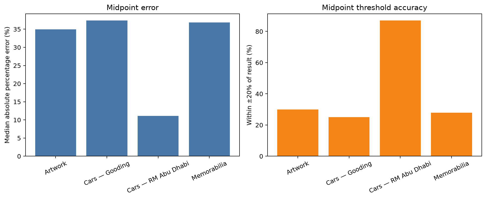

This chart compares the auction-house midpoint only. The RM Abu Dhabi Cars bar is based on 23 cars and is not representative of all Cars records.

### Artwork charts

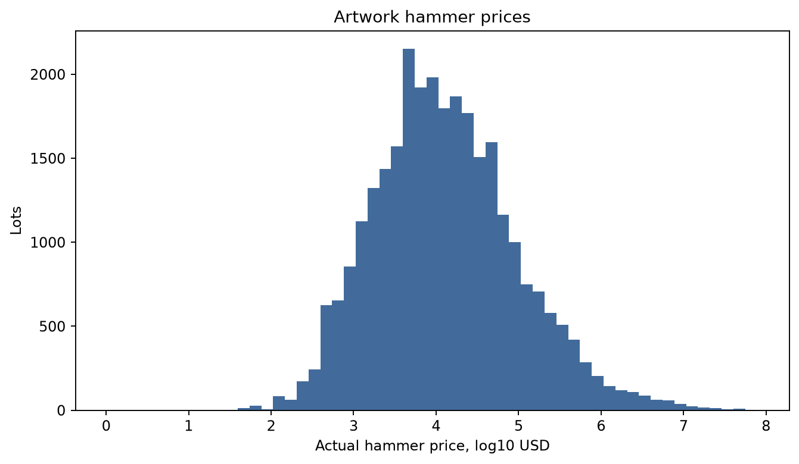

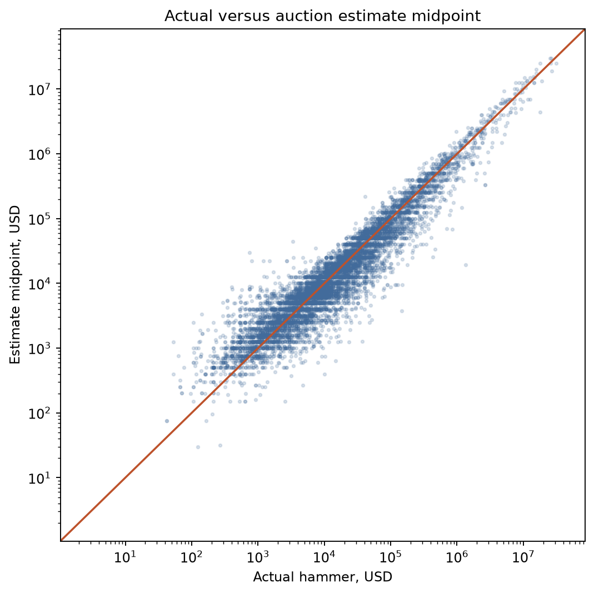

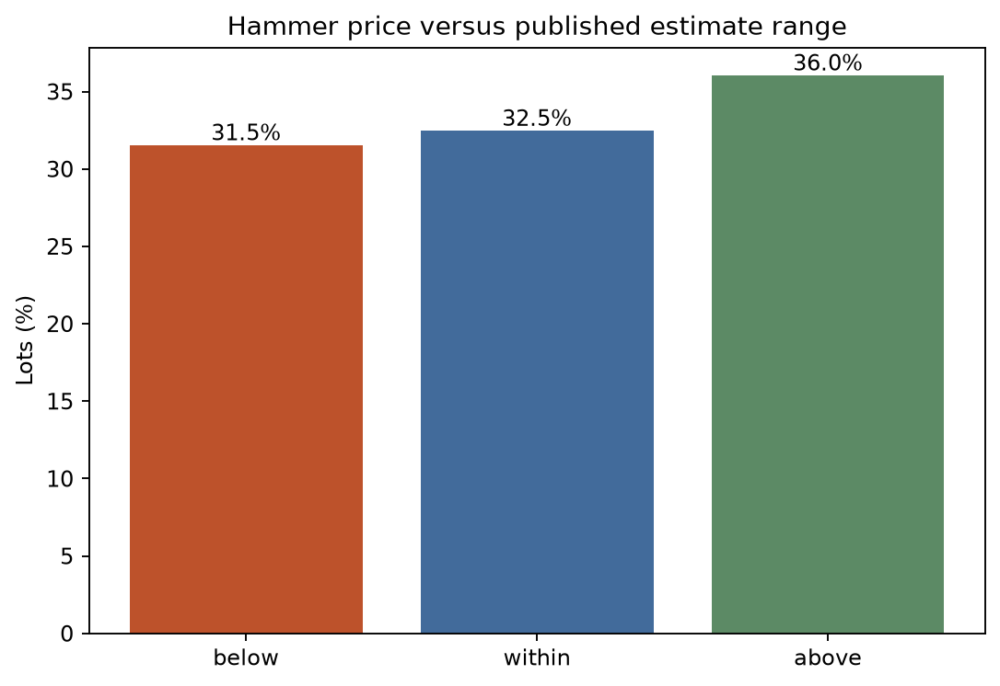

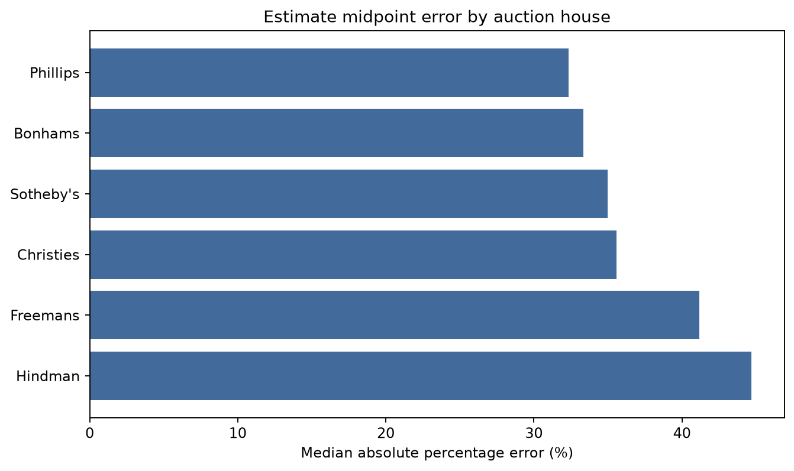

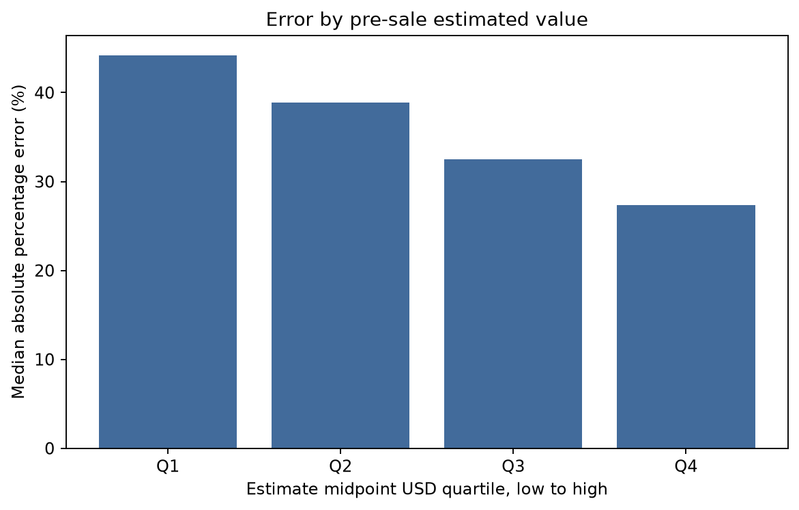

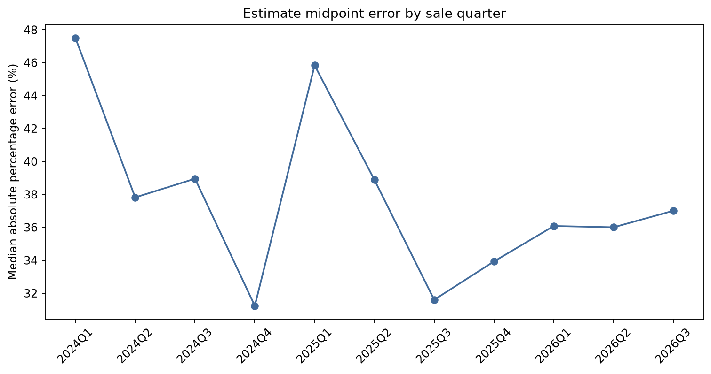

Together these show the actual-price distribution, calibration around the midpoint, below/within/above range outcomes, house differences, estimated-value bands, and sale-quarter results. They do not show Barkr or local-pricer predictions because those fields are absent.

### Cars charts

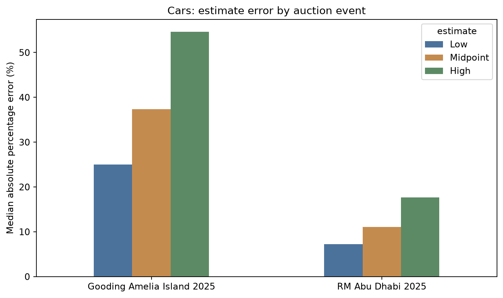

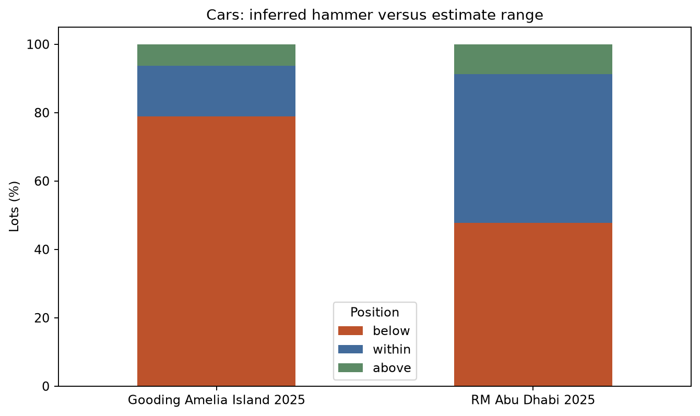

The Cars charts use inferred hammers after applying the official event premium schedules. Gooding and RM Abu Dhabi are shown separately because their premium schedules, value levels, and sample sizes differ.

### Memorabilia charts

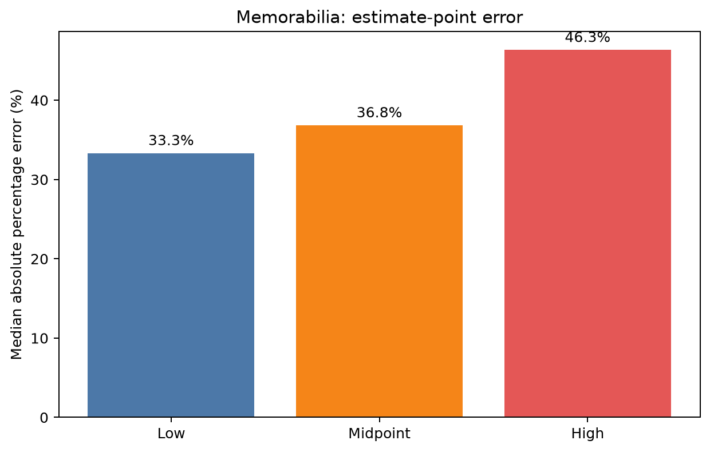

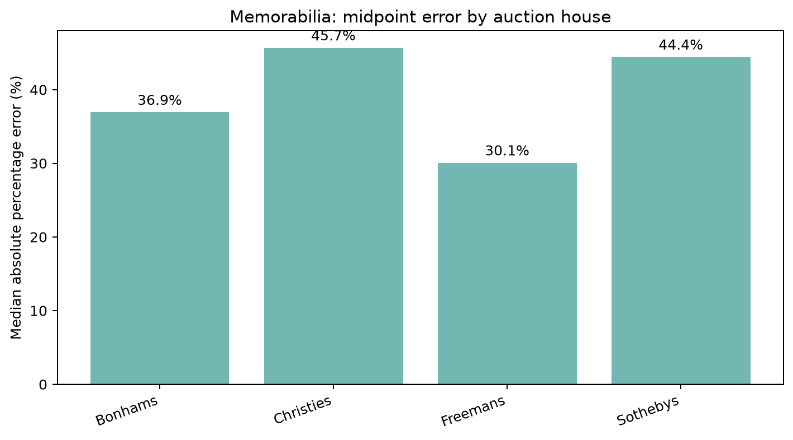

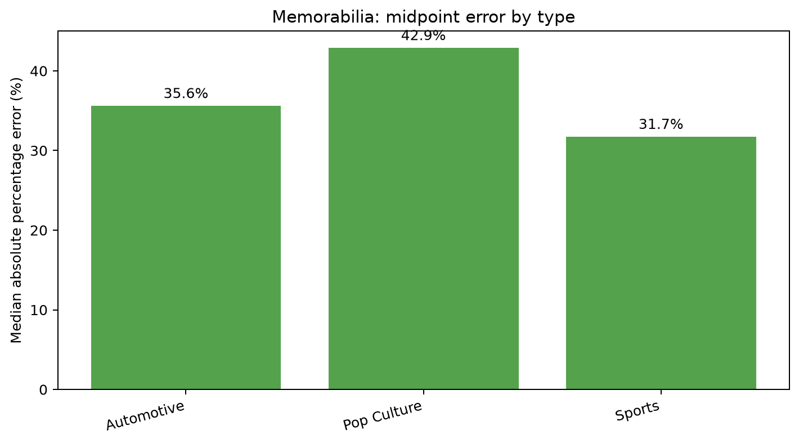

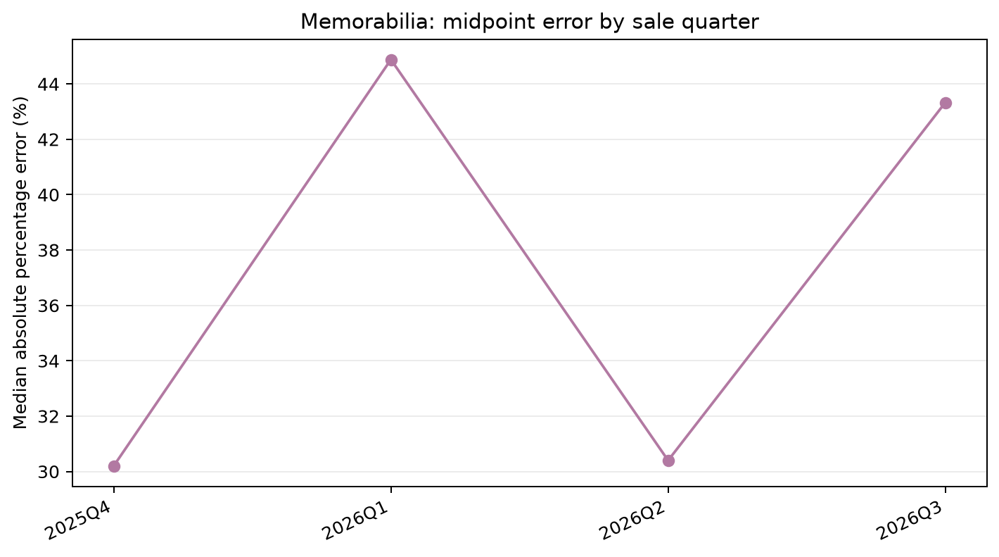

The Memorabilia charts include card lots because the source population was explicitly kept intact. Freemans’ house result is strongly influenced by its Sports and card-heavy mix.

## Metric definitions

For a positive actual result `A` and estimate `P`:

- Signed percentage error = `(P − A) / A × 100`.
- Absolute percentage error = `abs((P − A) / A) × 100`.
- Median absolute percentage error is the median of the absolute percentage errors, so it is less affected by extreme outliers than a mean.
- Signed bias is the median signed percentage error; positive means systematic overestimation and negative means systematic underestimation.
- Absolute dollar error is `abs(P_USD − A_USD)` and is reported only where both prices are in a comparable USD basis.
- A result is “within ±10/20/30%” when its absolute percentage error is no greater than that threshold.
- Range position is classified as below the low estimate, within the inclusive low–high range, or above the high estimate.

Zero or missing actual prices are excluded from error calculations. A missing actual price is never converted to zero. The eligible N is reported for every headline result.

## Important limitations and attention items

1. Confirm whether `ah_price` is consistently hammer and `ah_bp_price` consistently premium-inclusive across all sources. The ratios support that interpretation for Artwork and Memorabilia, but field conventions should be confirmed before external publication.
2. Review the four excluded Gooding Cars premium-basis anomalies and the excluded RM Paris EUR match against their original auction terms.
3. Verify the 247 inferred Christie's Memorabilia currencies with source-level sale records. The inference is supported by the linked Christie's sale descriptions but is still a data-repair step.
4. Review highlighted extreme outliers against their original lot pages. A single very small price can dominate percentage rankings.
5. Do not compare raw house rankings without controlling for asset type, estimated value, currency, and sample coverage.
6. Use sale dates for the reported time tables. Do not describe them as model-run trends until prediction timestamps are supplied.
7. Treat the Cars results as event benchmarks, not a Cars-wide estimate-accuracy conclusion.

## Required prediction-data layout

To finish every missing point, supply one combined prediction table or one file per method with these columns:

| Field | Requirement |
|---|---|
| `lot_url` or agreed stable ID | Joins exactly to the auction export; do not rely on a non-unique display title. |
| `asset_type` | Artwork, Cars, or Memorabilia. |
| `method` | Barkr, Local Pricer, Standard, or Llama. |
| `prediction` | Numeric value; preserve the original value before any FX conversion. |
| `currency` | Currency of the prediction. |
| `price_basis` | `hammer` or `premium_inclusive`. |
| `run_timestamp` | Date/time when the prediction was generated. |
| `prediction_available` | Distinguishes a missing price from a true zero or not-applicable prediction. |

The final model comparison should keep only one documented prediction per method and lot, preferably the latest valid prediction generated before the sale. It should report both prediction coverage and paired accuracy, then repeat the comparison by asset subtype, house, pre-sale value band, and sale/run period.

## Reproducibility and supporting files

- Full narrative source: [`three_asset_pricing_analysis_report.md`](three_asset_pricing_analysis_report.md).
- Artwork inputs and outputs: [`artwork_report`](artwork_report), [`artwork_estimate_report.py`](artwork_estimate_report.py), and [`artwork_daily_sale.json`](artwork_daily_sale.json).
- Cars inputs and outputs: [`cars_report`](cars_report), [`cars_estimate_report.py`](cars_estimate_report.py), and [`Cars_daily_sale.json`](Cars_daily_sale.json).
- Memorabilia cleaned sample and outputs: [`memorabilia_estimate_sample.py`](memorabilia_estimate_sample.py), [`memorabilia_estimate_sample.csv`](memorabilia_estimate_sample.csv), [`memorabilia_estimate_report.py`](memorabilia_estimate_report.py), and [`memorabilia_report`](memorabilia_report).
- Memorabilia chart generator: [`create_memorabilia_charts.py`](create_memorabilia_charts.py).

The report was generated from the daily-sale exports dated 25 September 2026. The current system date is 27 September 2026; no newer sales data were added to this report.
